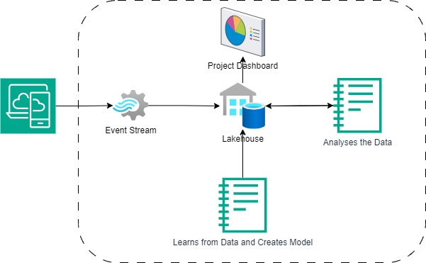

# Project Architecture

External Applications - External systems push the data to the event streams

Even streams - Collects the data and push to lakehouse

Notebook - learns from the data and creates model

Notebook - analyse the data and update the lakhouse

Report -Project report generated from lakehouse

## Demo setup instructions
Download and Import Learn NoteBook.ipynb to the Project, Create a new Data Lakehouse and add Data using either CSV files (Sample files are given in sampleData folder). Run the Learn NoteBook code and generate the model. Use the Model to generate the project predition and save it to the Lakehouse. Using the data, we can populate the report(Check the Company Projects Report.pbix for sample.)